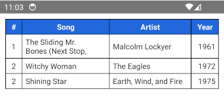
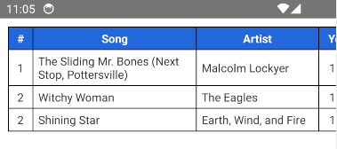
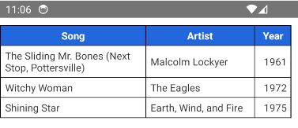

# react-native-table-element

React Native Table Element is a library that provides a customizable Table component for React Native applications. <br />
This library simplifies the process of creating table and provides a variety of options to customize the table

# Getting started

```
npm install react-native-table-element
```

or

```
yarn add react-native-table-element
```

# Table Props

| #   | Prop            | Params    | isRequired | Description                                                         |
| --- | --------------- | --------- | ---------- | ------------------------------------------------------------------- |
| 1   | data            | Array[][] | true       |                                                                     |
| 3   | header          | Array[]   | true       | Header label for this table                                         |
| 4   | columnsWidth    | Array[]   | true       | Define width for each columns in table                              |
| 5   | columnsAlign    | Array[]   | no         | Define text align for each columns in table (header is auto center) |
| 6   | borderColor     | String    | no         | Default #333                                                        |
| 7   | borderWidth     | number    | no         | Default 1                                                           |
| 8   | containerStyle  | ViewStyle | no         | Styling for container Table wrapper                                 |
| 9   | headerStyle     | ViewStyle | no         | Styling for table header                                            |
| 10  | headerTextStyle | TextStyle | no         | Styling for header text                                             |
| 11  | textStyle       | TextStyle | no         | Styling for text in all cell of table                               |

# Table Example

<div style="display: flex; gap: 5px;">
  
</div>

```jsx
import * as React from 'react';
import { StyleSheet, View } from 'react-native';
import Table from 'react-native-table-element';

export default function App() {
  return (
    <View style={styles.container}>
      <Table
        containerStyle={{ margin: 10 }}
        header={['#', 'Song', 'Artist', 'Year']}
        columnsWidth={[30, 160, 150, 50]}
        columnsAlign={['center', 'left', 'left', 'right']}
        data={[
          [
            1,
            'The Sliding Mr. Bones (Next Stop, Pottersville)',
            'Malcolm Lockyer',
            1961,
          ],
          [2, 'Witchy Woman', 'The Eagles', 1972],
          [2, 'Shining Star', 'Earth, Wind, and Fire', 1975],
        ]}
        borderColor="#000"
        borderWidth={1}
        headerStyle={{
          backgroundColor: '#2168db',
        }}
        headerTextStyle={{
          fontWeight: 'bold',
          color: '#fff',
        }}
        textStyle={{
          color: '#333',
        }}
      />
    </View>
  );
}

const styles = StyleSheet.create({
  container: {
    flex: 1,
    backgroundColor: '#fff',
  },
});
```

# Table Horizontal scroll Example

<div style="display: flex; gap: 5px;">
  
  
</div>

```jsx
<ScrollView horizontal>
  <View>
    <Table
      containerStyle={{ margin: 10 }}
      header={['#', 'Song', 'Artist', 'Year']}
      columnsWidth={[30, 200, 150, 50]}
      columnsAlign={['center', 'left', 'left', 'right']}
      data={[
        [
          1,
          'The Sliding Mr. Bones (Next Stop, Pottersville)',
          'Malcolm Lockyer',
          1961,
        ],
        [2, 'Witchy Woman', 'The Eagles', 1972],
        [2, 'Shining Star', 'Earth, Wind, and Fire', 1975],
      ]}
      borderColor="#000"
      borderWidth={1}
      headerStyle={{
        backgroundColor: '#2168db',
      }}
      headerTextStyle={{
        fontWeight: 'bold',
        color: '#fff',
      }}
      textStyle={{
        color: '#333',
      }}
    />
  </View>
</ScrollView>
```
